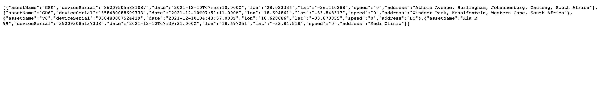
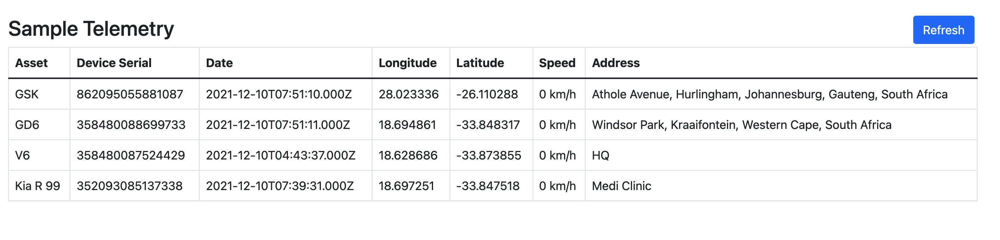

# fleet-api-sample
A reference application for making use of the Key Telematics Fleet API.

# Setup

## Step 1

To create the local `sqlite` database, run the `create-database.js` file in the root of the project with the following command:
```
node create-database.js
```

This will create the database in the root of the project called `sampledb.sqlite`, then the `knex` migrations up to the latest migration wil be run last and create the needed tables.

## Step 2

This project makes use of `dotenv` and requires a `.env` file in the root of the project with the following variables to load from

| VARIABLE    | DESCRIPTION                                                                 |
|-------------|-----------------------------------------------------------------------------|
| EXPORT_TASK_HOST | The url of the stream endpoint to call for stream data |
| EXPORT_TASK_API_KEY | The api key created in the export tasks section in the UI |
| KEY_HOST    | The KeyTelematics api host to make request to                             |
| API_KEY    | The api key generated for the user to call the fleet api endpoints                              |
| OWNER_ID    | The id of the company that owns the devices and assets                      |

## Step 3

To run the project there are 2 options to choose from

The pull implementation that makes use of calling the api and export task for data using HTTP calls:
```
npm run serve-pull
```
The push implementation that creates a `telemetry` endpoint and receives data from firehose over HTTP in batches:
```
npm run serve-push
```

Both options will first call the Fleet api to get `assets` and `devices`, there after depending on the option used the telemetry and change notifications mechanism will differ.


The project will start up with `nodemon` on port `5000`. The project will start up and do the following:

1. Load up environment variables specified in the `.env` file.
2. Create the `knex` instance to the `sqlite` database.
3. Set apiKey from the api key specified in the `.env` file.
4. Setup a basic endpoint with `express server`. 
5. Start fetching data from the KeyTelematics Fleet-Api.
6. Insert fetched data into the `sqlite` database.
7. The node app is now running and the basic `express` endpoint can be hit to view a summary of the data that was pulled from the api.

# Endpoints


The telemetry endpoint [http://localhosthost:5000/telemetry](http://localhosthost:5000/telemetry)

 

The UI that calls the telemetry endpoint [http://localhost:5000](http://localhost:5000)



# AWS Firehose

When making use of the firehose export task implementation the following applies or the batch wont be consumed successfully

After consuming the batch data you need to return a `HTTP 200` response.

With the `HTTP 200` response you need to return in the body:
```
{
    // The request id received from the batch by firehose
    'requestId': '123456',

    // The timestamp when the batch was consumed by your app
    'timestamp': 123213213
}
```
Only after returning this will Firehose mark the batch as `delivered successfully` in AWS.
